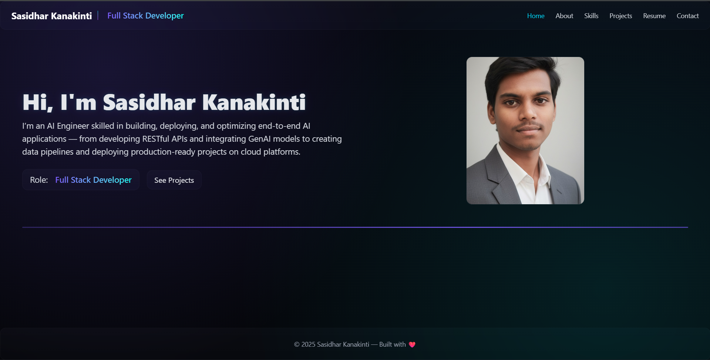
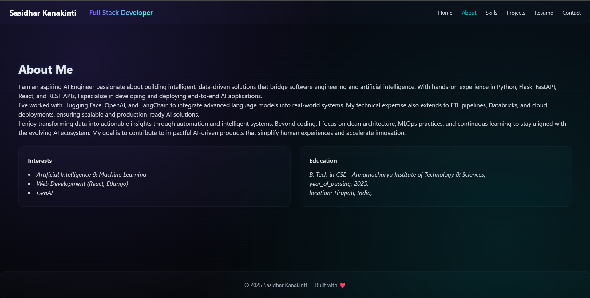
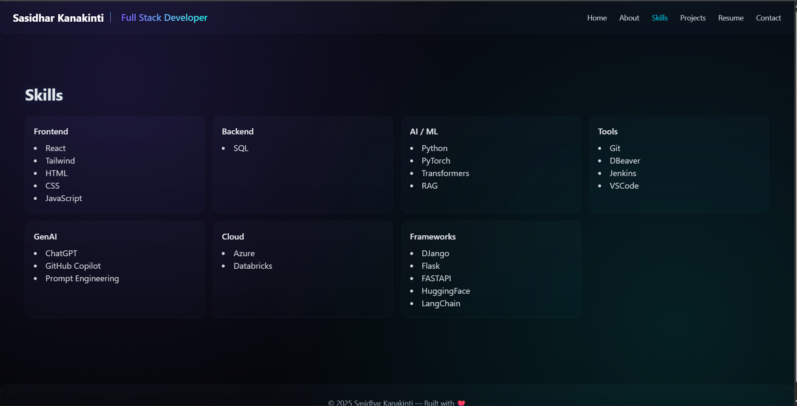
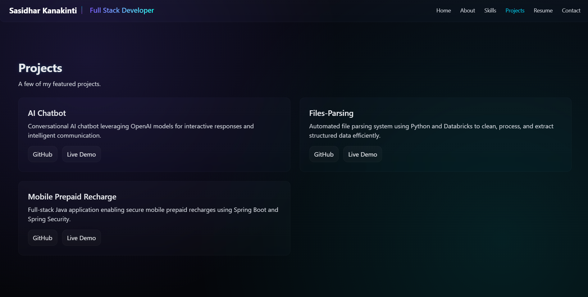
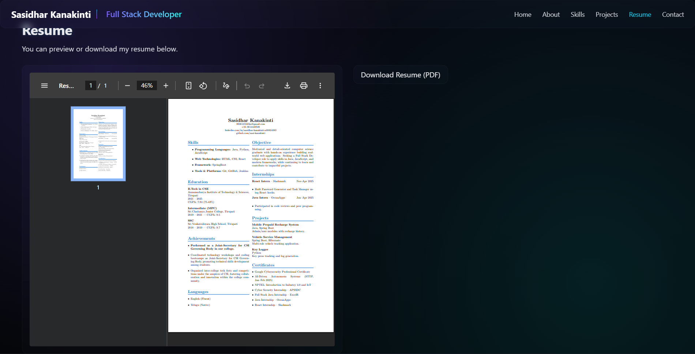
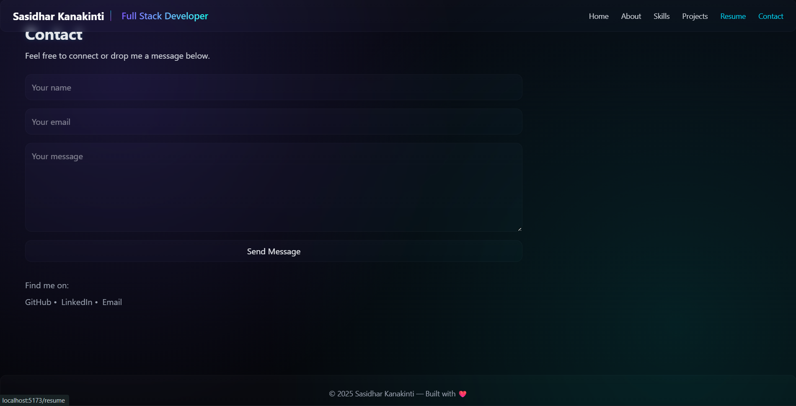

# 🌐 Portfolio Website — Sasidhar Kanakinti

### 🧠 Overview
A modern, multi-page **portfolio website** built using **React + Vite + TailwindCSS + Framer Motion**, featuring a sleek futuristic UI, smooth animations, and an integrated **EmailJS contact form** for direct communication.

---

## 🚀 Demo
**🔗 Live Deployment:** [demo-deployment.com]([https://demo-deployment.com](https://portfolio-multipage-8a6rj7059-sasidhars-projects-e52b7d2f.vercel.app/))

---

## 🖼️ Project Previews

| Preview | Description |
|----------|--------------|
|  | Home Page |
|  | About Section |
|  | Skills Section |
|  | Projects Page |
|  | Resume Page |
|  | Contact Page with working form |

---

## ⚙️ Tech Stack

**Frontend:**  
- ⚡ [Vite](https://vitejs.dev/) — Fast build tool for modern React projects
- ⚛️ [React.js](https://react.dev/) — Component-based UI framework
- 🎨 [TailwindCSS](https://tailwindcss.com/) — Utility-first CSS styling
- 💫 [Framer Motion](https://www.framer.com/motion/) — Page transition animations

**Integrations:**  
- ✉️ [EmailJS](https://www.emailjs.com/) — Send messages directly to email

---

## 🧩 Features

- ⚡ **Lightning-fast** load speeds with Vite
- 🎨 **Futuristic neon-glass UI** built with TailwindCSS
- 🧭 **Multi-page routing** using React Router DOM
- 💌 **Functional contact form** powered by EmailJS
- 💻 **Responsive design** for all screen sizes
- 🌗 **Dark aesthetic** inspired by tech and AI visuals

---

## 🧰 Installation & Setup

### 1️⃣ Clone the repository
```bash
git clone https://github.com/<your-username>/portfolio.git
cd portfolio
```

### 2️⃣ Install dependencies
```bash
npm install
```

### 3️⃣ Set up EmailJS (for contact form)
Create a `.env` file in the root directory and add your EmailJS credentials:
```bash
VITE_EMAILJS_SERVICE_ID=your_service_id
VITE_EMAILJS_TEMPLATE_ID=your_template_id
VITE_EMAILJS_PUBLIC_KEY=your_public_key
```

### 4️⃣ Run the project
```bash
npm run dev
```
Open the app in your browser: `http://localhost:5173`

### 5️⃣ Build for production
```bash
npm run build
```

This generates a `dist/` folder ready for deployment.

---

## 🚀 Deployment (Vercel Recommended)

1. Push your code to GitHub.  
2. Go to [Vercel.com](https://vercel.com) → Import your repo.  
3. Set up environment variables in **Vercel → Project Settings → Environment Variables**:

| Variable | Description |
|-----------|-------------|
| `VITE_EMAILJS_SERVICE_ID` | Your EmailJS service ID |
| `VITE_EMAILJS_TEMPLATE_ID` | Your EmailJS template ID |
| `VITE_EMAILJS_PUBLIC_KEY` | Your EmailJS public key |

4. Deploy and enjoy 🎉

---

## 📬 Contact Form Setup (EmailJS)

1. Create a free account on [EmailJS](https://www.emailjs.com/).  
2. Add a new **Email Service** (e.g., Gmail).  
3. Create a **new Email Template** using variables:
   - `from_name`
   - `reply_to`
   - `message`
4. Paste your IDs into `.env` as shown above.  
5. Done ✅ — messages will arrive directly in your Gmail inbox.

---

## 🪄 Customization
- Update your details in `/src/pages/Home.jsx` and `/src/pages/About.jsx`.
- Replace the profile picture in `/src/assets/profile.jpg`.
- Modify background gradients and effects in `/src/index.css`.
- Update project links and details inside `/src/pages/Projects.jsx`.

---

## 🧑‍💻 Author
**Sasidhar Kanakinti**  
AI/ML Engineer | Full Stack Developer  
📧 [9908135565ks@gmail.com](mailto:9908135565ks@gmail.com)

---

## 📝 License
This project is open source and available under the [MIT License](LICENSE).

---

> © 2025 Sasidhar Kanakinti — Built with ❤️ using React + TailwindCSS

